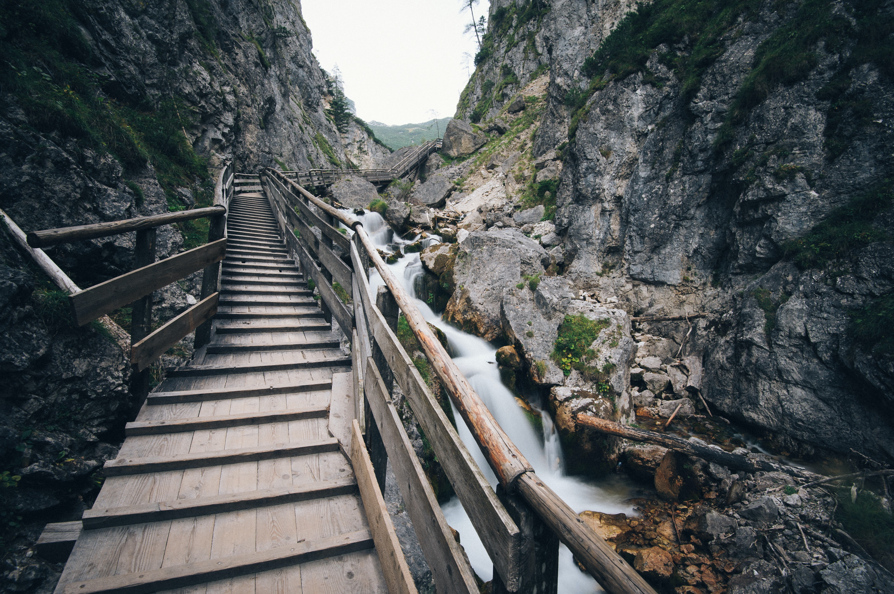

# palettemaker
Create color palettes from images

## Usage
`python palettemaker.py [-h] [-o OUTPUT] [-e EMBED] [-s] [-z] img num`

Use `--output` to save color palette to file, and `--embed` to palette in original image.
Use `--show` to display images without saving to file.
Use `--horizontal` to display palette horizontally.

## Examples
Source image

Color palette

Embedded image

